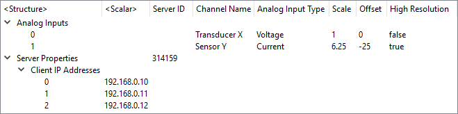

Qt Data Tree Model
==================

This library provides a flexible way to display hierarchical data in a Qt C++
model. The current implementation supports JSON documents; it is quite feasible
to adapt the library to support QVariantList/QVariantMap trees and certain CBOR
trees too.

Rather than having a single row per item, key-value pairs are placed under named
columns. For example, the following JSON document contains an array of similar
objects which can be compacted into a table:

    [
        {
            "First Name": "Hua",
            "Last Name": "Li",
            "Phone Number": "+86 21 51748525",
            "Country": "China"
        }, {
            "First Name": "Gildong",
            "Last Name": "Hong",
            "Phone Number": "+82 31 712 0045",
            "Country": "South Korea"
        }, {
            "First Name": "Tarou",
            "Last Name": "Yamada",
            "Phone Number": "+81 3 6264 4500",
            "Country": "Japan"
        }, {
            "First Name": "Jane",
            "Last Name": "Doe",
            "Phone Number": "+1 408 906 8400",
            "Country": "USA"
        }, {
            "First Name": "Erika",
            "Last Name": "Mustermann",
            "Phone Number": "+49 30 63923257",
            "Country": "Germany"
        }, {
            "First Name": "Pyotr",
            "Last Name": "Ivanov",
            "Phone Number": "+7 921 097 7252",
            "Country": "Russia"
        }, {
            "First Name": "Kari",
            "Last Name": "Nordmann",
            "Phone Number": "+47 21 08 04 20",
            "Country": "Norway"
        }
    ]

Here is a more hierarchical example:

    {
        "Server Properties": {
            "Server ID": "314159",
            "Client IP Addresses": [
                "192.168.0.10",
                "192.168.0.11",
                "192.168.0.12"
            ]
        },
        "Analog Inputs": [
            {
                "Channel Name": "Transducer X",
                "Analog Input Type": "Voltage",
                "Scale": 1,
                "Offset": 0,
                "High Resolution": false
            },
            {
                "Channel Name": "Sensor Y",
                "Analog Input Type": "Current",
                "Scale": 6.25,
                "Offset": -25,
                "High Resolution": true
            }
        ]
    }

System Requirements
-------------------
* A C++11 compliant compiler
* A recent version of Qt 5 (tested on Qt 5.11)

Examples
--------
Use Qt Creator (or your preferred IDE) to open the _JsonTreeModelExample.pro_
from the [examples/](examples) folder.

Documentation
-------------
* To use this library, see _doc/build/API/html/index.html_
* To hack this library, see _doc/build/Implementation/html/index.html_

Usage
-----
Simply copy the source files as-is from [src/](src) into your own project.

Licensing
---------
Copyright (c) 2018 Sze Howe Koh <<szehowe.koh@gmail.com>>

The Qt Data Tree Model library is published under the Mozilla Public License
v2.0 (see [LICENSE.MPLv2](LICENSE.MPLv2)), while examples are published under
the MIT License (see [examples/LICENSE.MIT](examples/LICENSE.MIT)).
